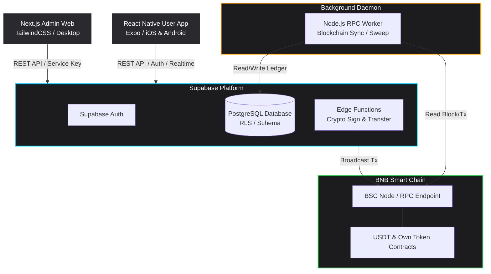
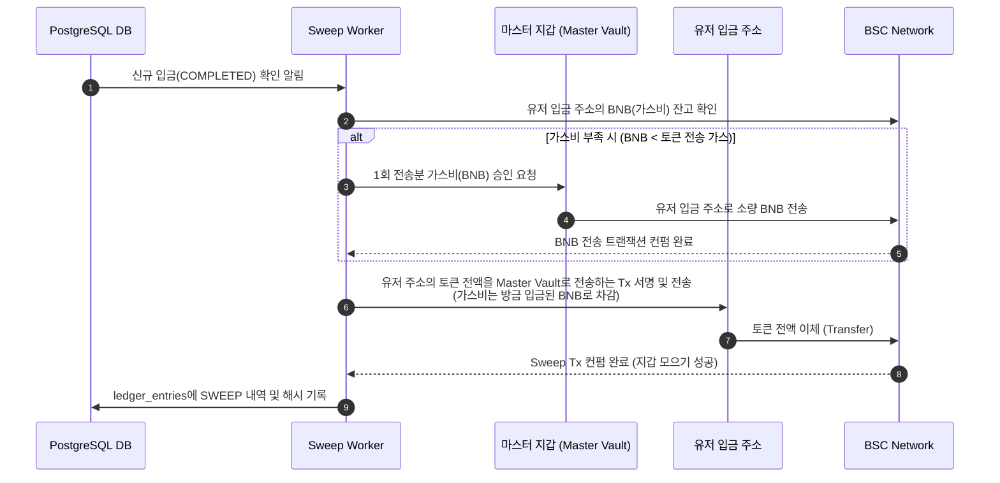
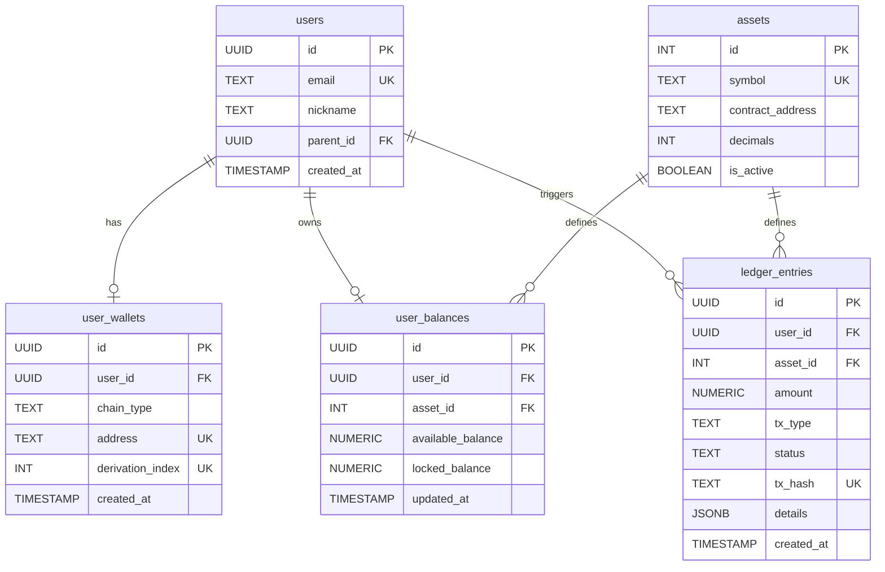

# 📄 BSC 기반 멀티 토큰 중앙화 지갑 및 관리자 시스템 개발 사양서
> **BSC-based Multi-Token Centralized Wallet & Admin System Technical Specification**

본 문서는 BNB Smart Chain(BSC) 메인넷의 **USDT(BEP-20)** 및 **자체 발행 토큰(BEP-20)**을 지원하는 중앙화 지갑 플랫폼의 핵심 설계 및 개발 지침을 정의합니다. 본 시스템은 고성능 실시간 자산 관리, 철저한 트랜잭션 원장 무결성 보장, 그리고 다계층 보안 모델을 지향합니다.

---

## 1. 프로젝트 개요 (Overview)

본 프로젝트는 안전하고 신뢰할 수 있는 가상자산 예치·송금·스왑 환경과 계층형 조직도(마케팅 보너스)를 지원하는 **모바일 사용자 앱(React Native)** 및 **관리자 백오피스 웹(Next.js)**, 그리고 **백엔드(Supabase & DB / RPC Node Worker)**로 구성된 중앙화 지갑 솔루션입니다.

*   **지원 네트워크:** BNB Smart Chain (BSC) Mainnet
*   **지원 자산:** BNB (네이티브 가스비), USDT (BEP-20), 자체 토큰 (BEP-20)
*   **핵심 비즈니스:** 실시간 자산 대시보드, 간편 스왑, 추천인 트리(조직도), 마케팅 보너스 정산, 중앙 집중형 출금 제어 및 핫월렛 보안 관리.

---

## 2. 시스템 아키텍처 (Architecture)

전체 시스템은 모바일 앱과 어드민 웹이 중앙의 **Supabase Platform**을 공유하고, 백그라운드에서 실시간 블록체인 이벤트를 추적하는 **RPC Node Worker**가 독립적으로 동작하는 구조입니다.



### 2.1 컴포넌트별 역할 정의

#### 📱 사용자 앱 (React Native / Expo)
*   **플랫폼:** iOS 및 Android (크로스 플랫폼)
*   **핵심 기능:**
    *   보안 강화 생체 인증 (FaceID / TouchID) 및 하이브리드 JWT 세션 관리.
    *   입금 주소 QR 코드 스캔 및 생성.
    *   실시간 자산 잔고 대시보드 (Supabase Realtime 연동).
    *   USDT ↔ 자체 토큰 스왑 및 전송 인터페이스.
    *   추천인 코드를 활용한 계층형 조직도 트리 뷰 구현.

#### 🖥️ 관리자 웹 (Next.js / TailwindCSS)
*   **플랫폼:** 데스크톱 브라우저 최적화 백오피스
*   **핵심 기능:**
    *   대용량 트랜잭션 데이터 그리드 (실시간 입출금 원장 추적).
    *   회원 정보 검색, 차단 및 자산 임의 조정(수동 보정) 툴.
    *   일별/월별 매출 및 출금, 보너스 지급 통계 시각화 차트.
    *   출금 대기 건에 대한 승인/반려 제어판.
    *   **Master Vault 및 Hot Wallet**의 자산 잔고 실시간 모니터링.

#### ⚡ 백엔드 및 인프라 (Supabase & DB)
*   **데이터베이스:** PostgreSQL (Supabase DB). Row-Level Security(RLS) 정책을 통해 클라이언트 레벨의 불법 데이터 접근을 완벽 차단.
*   **비즈니스 API:** Supabase Edge Functions 및 Next.js API Routes.
*   **보안 모듈:** 개인키 암호화 보관 및 출금 서명 처리.

#### ⚙️ 블록체인 동기화 데몬 (Node.js RPC Worker)
*   **실행 환경:** 독자적인 Node.js 프로세스 (PM2 또는 Docker container 기반 상시 작동).
*   **역할:** BSC RPC 노드를 폴링(Polling)하거나 웹소켓 구독을 통해 `Transfer` 이벤트를 실시간 모니터링하여 입금을 감지하고 데이터베이스 원장(Ledger)에 무결하게 기록.

---

## 3. 핵심 블록체인 메커니즘 (Core Crypto Flow)

### 3.1 입금 및 잔고 동기화 (Deposit)

사용자가 회원가입을 완료하거나 입금 화면을 요청하면, BIP-44 규격의 HD 지갑(Hierarchical Deterministic Wallet) 파생 규칙에 따라 유저 고유의 지갑 주소를 할당합니다.

```mermaid
sequenceDiagram
    autonumber
    actor User as 사용자
    participant App as 앱 (React Native)
    participant DB as PostgreSQL DB
    participant Worker as RPC Node Worker
    participant BSC as BSC Network

    User->>App: 입금 주소 화면 진입
    App->>DB: user_wallets 조회 (주소 존재 여부 확인)
    alt 주소 미존재 시 (최초 진입)
        Note over DB: HD Wallet Derivation Index 증가<br/>유저 고유 BSC 주소 생성 및 매핑
        DB-->>App: 새 주소 및 QR 데이터 반환
    else 주소 존재 시
        DB-->>App: 기존 할당 주소 반환
    end
    
    User->>BSC: 외부 지갑에서 유저 고유 주소로 토큰 전송
    
    loop Realtime Block Scan
        Worker->>BSC: 최신 블록의 Transfer(from, to, value) 이벤트 Polling
        BSC-->>Worker: Tx 이벤트 목록 반환
    end
    
    Worker->>DB: 'to' 주소가 user_wallets에 존재하는지 검사
    rect rgb(28, 28, 30)
        Note over Worker, DB: 블록 컨펌 수 검증 완료 시 (e.g., 3 ~ 5 Blocks)
        Worker->>DB: 1. ledger_entries에 DEPOSIT (PENDING -> COMPLETED) 기록<br/>2. user_balances의 available_balance를 +Amount 가산
    end
```



---

### 3.2 지갑 모으기 (Sweeping / Consolidation)

사용자의 개별 입금 주소에 들어온 토큰은 중앙 통제를 위해 **회사 마스터 지갑(Master Vault)**으로 실시간 집계(Sweep)되어야 합니다. 이때, 개별 주소에 수수료로 쓰일 가스비(BNB)가 없는 문제를 해결하기 위해 **가스비 대납 프로세스**를 거치게 됩니다.



---

### 3.3 출금 워크플로우 (Withdrawal)

중앙화 지갑의 최고 보안 원칙은 **"인터넷에 상시 연결되어 자동 서명되는 핫월렛의 노출을 막고, 반드시 검증된 트랜잭션만 송출한다"**는 점입니다.

```mermaid
sequenceDiagram
    autonumber
    actor User as 사용자
    actor Admin as 관리자
    participant App as 앱 (React Native)
    participant DB as PostgreSQL DB
    participant AdminWeb as 관리자 웹 (Next.js)
    participant Security as 보안 출금 엔진 (KMS/Edge)
    participant BSC as BSC Network

    User->>App: 출금 신청 (토큰 종류, 수량, 목적지 주소)
    App->>DB: 출금 트랜잭션 요청 (API 호출)
    
    rect rgb(42, 42, 46)
        Note over DB: [데이터베이스 원장 처리]<br/>1. available_balance에서 수량 차감 (-Amount)<br/>2. locked_balance로 수량 이동 (+Amount)<br/>3. ledger_entries에 WITHDRAW (PENDING) 생성
    end
    
    AdminWeb->>DB: 승인 대기 목록 조회
    DB-->>AdminWeb: PENDING 상태의 출금 신청 반환
    Admin->>AdminWeb: 리스크 확인 후 [출금 승인] 클릭
    AdminWeb->>Security: 출금 승인 API 호출 (Service Key 인증)
    
    rect rgb(28, 28, 30)
        Note over Security: KMS를 통해 암호화된 Hot Wallet 개인키 복호화 (메모리 로드)<br/>트랜잭션 서명 및 네트워크 브로드캐스팅
    end
    
    Security->>BSC: Transfer(Master -> Target Address) 트랜잭션 전송
    BSC-->>Security: Tx Hash 반환
    
    alt Tx 성공 컨펌 완료 시
        Security->>DB: 1. locked_balance에서 수량 영구 차감<br/>2. ledger_entries의 상태를 COMPLETED로 변경 및 Tx Hash 기록
    else Tx 실패 시
        Security->>DB: 1. locked_balance에서 available_balance로 롤백<br/>2. ledger_entries의 상태를 FAILED로 변경
    end
```



---

## 4. 데이터베이스 스키마 설계 (Supabase / PostgreSQL)

데이터 정합성과 무결성을 확보하기 위해 모든 잔고 변경은 **복식부기 원장(Ledger) 구조**를 기반으로 하며, 데이터베이스 수준의 제약 조건을 통해 초과 출금(Over-drafting)을 원천 방지합니다.

### 4.1 데이터 관계도 (ERD)



### 4.2 SQL DDL (Table Schema & Security RLS)

```sql
-- ==========================================
-- 1. 사용자 테이블 (Supabase Auth 연동)
-- ==========================================
CREATE TABLE public.users (
    id UUID REFERENCES auth.users NOT NULL PRIMARY KEY,
    email TEXT UNIQUE NOT NULL,
    nickname TEXT,
    parent_id UUID REFERENCES public.users(id), -- 추천인 (조직도 구현용)
    created_at TIMESTAMP WITH TIME ZONE DEFAULT timezone('utc'::text, now()) NOT NULL
);

-- RLS 활성화
ALTER TABLE public.users ENABLE ROW LEVEL SECURITY;

-- RLS 정책 설정: 본인 데이터만 조회 가능
CREATE POLICY "Users can view their own profile" 
    ON public.users FOR SELECT 
    USING (auth.uid() = id);

-- ==========================================
-- 2. 유저별 블록체인 입금 주소 매핑 테이블
-- ==========================================
CREATE TABLE public.user_wallets (
    id UUID PRIMARY KEY DEFAULT gen_random_uuid(),
    user_id UUID REFERENCES public.users(id) ON DELETE CASCADE NOT NULL,
    chain_type TEXT DEFAULT 'BSC' NOT NULL,
    address TEXT UNIQUE NOT NULL, -- 유저 고유 입금용 주소
    derivation_index INT UNIQUE NOT NULL, -- HD 지갑 인덱스 번호
    created_at TIMESTAMP WITH TIME ZONE DEFAULT timezone('utc'::text, now()) NOT NULL
);

ALTER TABLE public.user_wallets ENABLE ROW LEVEL SECURITY;

CREATE POLICY "Users can view their own wallet addresses" 
    ON public.user_wallets FOR SELECT 
    USING (auth.uid() = user_id);

-- ==========================================
-- 3. 자산 종류 마스터 데이터 (USDT, 자체토큰 등)
-- ==========================================
CREATE TABLE public.assets (
    id INT GENERATED ALWAYS AS IDENTITY PRIMARY KEY,
    symbol TEXT UNIQUE NOT NULL, -- 'USDT', 'MYTOKEN'
    contract_address TEXT, -- USDT contract 주소 혹은 자체토큰 주소 (BNB일 경우 NULL)
    decimals INT DEFAULT 18 NOT NULL,
    is_active BOOLEAN DEFAULT true NOT NULL
);

-- 모든 사람이 자산 종류는 볼 수 있음
ALTER TABLE public.assets ENABLE ROW LEVEL SECURITY;
CREATE POLICY "Assets information is public" 
    ON public.assets FOR SELECT 
    USING (true);

-- ==========================================
-- 4. 내부 잔고 테이블 (중앙 장부식 관리)
-- ==========================================
CREATE TABLE public.user_balances (
    id UUID PRIMARY KEY DEFAULT gen_random_uuid(),
    user_id UUID REFERENCES public.users(id) ON DELETE CASCADE NOT NULL,
    asset_id INT REFERENCES public.assets(id) NOT NULL,
    available_balance NUMERIC(36, 18) DEFAULT 0 NOT NULL, -- 출금/스왑 가능한 잔고
    locked_balance NUMERIC(36, 18) DEFAULT 0 NOT NULL,    -- 출금 대기 중인 묶인 잔고
    updated_at TIMESTAMP WITH TIME ZONE DEFAULT timezone('utc'::text, now()) NOT NULL,
    CONSTRAINT unique_user_asset UNIQUE (user_id, asset_id),
    CONSTRAINT positive_available CHECK (available_balance >= 0),
    CONSTRAINT positive_locked CHECK (locked_balance >= 0)
);

ALTER TABLE public.user_balances ENABLE ROW LEVEL SECURITY;

CREATE POLICY "Users can view their own balances" 
    ON public.user_balances FOR SELECT 
    USING (auth.uid() = user_id);

-- ==========================================
-- 5. 통합 거래 원장 테이블 (Ledger)
-- ==========================================
CREATE TABLE public.ledger_entries (
    id UUID PRIMARY KEY DEFAULT gen_random_uuid(),
    user_id UUID REFERENCES public.users(id) NOT NULL,
    asset_id INT REFERENCES public.assets(id) NOT NULL,
    amount NUMERIC(36, 18) NOT NULL, -- 입금은 (+), 출금/스왑은 (-)
    tx_type TEXT NOT NULL, -- 'DEPOSIT', 'WITHDRAW', 'SWAP_IN', 'SWAP_OUT', 'BONUS'
    status TEXT DEFAULT 'PENDING' NOT NULL, -- 'PENDING', 'COMPLETED', 'FAILED'
    tx_hash TEXT UNIQUE, -- 중복 입금 처리 방지를 위한 UNIQUE 제약
    details JSONB, -- 추가 데이터 (스왑 레이트, 추천인 보너스 대상 유저 정보 등)
    created_at TIMESTAMP WITH TIME ZONE DEFAULT timezone('utc'::text, now()) NOT NULL
);

ALTER TABLE public.ledger_entries ENABLE ROW LEVEL SECURITY;

CREATE POLICY "Users can view their own ledger entries" 
    ON public.ledger_entries FOR SELECT 
    USING (auth.uid() = user_id);
```

> [!NOTE]
> 관리자 웹(Next.js 어드민) 및 백그라운드 워커는 RLS 우회 권한을 갖는 Supabase `service_role` 키를 헤더에 포함하여 통신하기 때문에 RLS 제한 없이 전체 테이블의 조회 및 수정(승인/반영 등) 처리가 가능합니다.

---

## 5. 핵심 API 및 통신 명세 (API Specifications)

### 5.1 사용자용 API (React Native 통신용)

| Method | Endpoint | Description | Request Body / Query | Success Response (200 / 201) |
| :--- | :--- | :--- | :--- | :--- |
| **POST** | `/api/v1/auth/login` | 이메일/비밀번호 혹은 소셜 로그인 및 JWT 발급 | `{"email": "...", "password": "..."}` | `{"access_token": "...", "user": {"id": "...", "email": "..."}}` |
| **GET** | `/api/v1/wallet/balances` | 로그인한 사용자의 자산별 잔고 리스트 조회 | *None (JWT Authorization Header)* | `[{"symbol": "USDT", "available": 500.0, "locked": 100.0}, ...]` |
| **GET** | `/api/v1/wallet/address` | 유저의 입금용 주소 조회 및 신규 생성 | *None (JWT Authorization Header)* | `{"chain_type": "BSC", "address": "0xabc...", "qr_data": "ethereum:0xabc..."}` |
| **POST** | `/api/v1/wallet/withdraw` | 외부 주소로 토큰 출금 신청 | `{"asset_id": 1, "amount": 150.0, "target_address": "0xdef..."}` | `{"status": "PENDING", "withdraw_id": "uuid"}` |
| **POST** | `/api/v1/wallet/swap` | USDT ↔ 자체 토큰 스왑 수행 | `{"from_asset_id": 1, "to_asset_id": 2, "amount": 100}` | `{"swap_tx_id": "uuid", "exchanged_amount": 990}` |
| **GET** | `/api/v1/network/tree` | 추천인 체계 기반 트리 데이터 조회 | *None (JWT Authorization Header)* | `{"id": "user-uuid", "nickname": "A", "children": [{"id": "child-uuid", "nickname": "B"}]}` |

### 5.2 관리자용 API (Next.js 웹 통신용 - `service_role` 인가 필)

| Method | Endpoint | Description | Request Body / Query | Success Response (200 / 201) |
| :--- | :--- | :--- | :--- | :--- |
| **GET** | `/api/v1/admin/dashboard/stats` | 대시보드 통계 집계 데이터 조회 | *None* | `{"total_deposits": 25000.0, "total_withdrawals": 12000.0, "new_users": 142}` |
| **GET** | `/api/v1/admin/users` | 전체 회원 명단 및 정보 조회 | `?page=1&limit=50&search=keyword` | `{"total": 1200, "users": [{"id": "...", "email": "...", "balance": [...]}]}` |
| **GET** | `/api/v1/admin/withdrawals/pending` | 승인 대기 중인 출금 목록 조회 | *None* | `[{"withdraw_id": "uuid", "user_email": "...", "amount": 150.0, "target": "0xdef..."}]` |
| **POST** | `/api/v1/admin/withdrawals/approve` | 대기 중인 출금 최종 승인 및 핫월렛 전송 실행 | `{"withdraw_id": "uuid"}` | `{"status": "COMPLETED", "tx_hash": "0xhash..."}` |
| **GET** | `/api/v1/admin/analytics/daily` | 일별 매출 및 자산 흐름 차트 시각화 데이터 | `?start_date=2026-07-01` | `[{"date": "2026-07-01", "deposit_sum": 5000.0, "withdraw_sum": 3000.0}]` |

---

## 6. 보안 가이드라인 (Security Framework)

### 6.1 키 관리 시스템 (Key Management System - KMS)
1. **마스터 시드/프라이빗 키 격리:** 지갑 주소를 생성하고 관리하기 위한 마스터 니모닉(Mnemonic)과 출금용 핫월렛의 개인키는 프론트엔드 및 일반 DB 테이블에 절대 노출되어서는 안 됩니다.
2. **저장 방식:** Supabase Vault 또는 환경 변수에 강력하게 암호화(AES-256)하여 저장하며, Next.js 백엔드 또는 Supabase Edge Functions의 격리된 실행 메모리 영역에서 서명할 때만 일시적으로 복호화되어 로드됩니다.

### 6.2 멱등성 (Idempotency) 보장
1. **중복 입금 처리 차단:** 블록체인 상의 동일한 거래가 중복 반영되는 것을 원천 봉쇄하기 위해, `ledger_entries` 테이블의 `tx_hash` 컬럼에 UNIQUE 제약 조건을 설정하고 DB 트랜잭션 시 `ON CONFLICT (tx_hash) DO NOTHING` 전략을 취합니다.
2. **트랜잭션 ACID:** 사용자 잔고 조정(`user_balances`)과 내역 기록(`ledger_entries`)은 PostgreSQL의 단일 트랜잭션(`BEGIN; ... COMMIT;`)으로 묶어 원장은 기록되었는데 잔고가 오르지 않거나, 잔고만 오르고 원장이 없는 불일치 상태가 발생하지 않도록 개발합니다.

### 6.3 비상 정지 메커니즘 (Circuit Breaker)
*   일정 금액 이상의 고액 출금 요청은 자동 승인 프로세스에서 제외되어 반드시 관리자의 이중 확인 및 서명 승인을 받도록 설계합니다.
*   단시간 내에 특정 유저 계정에서 비정상적인 전송 이벤트가 다발적으로 검출될 경우, 해당 계정의 `user_balances` 상태를 잠금(`Locked`) 처리하는 보안 방어 스크립트를 작성합니다.

---

## 7. 추천 개발 프로젝트 폴더 구조 (Proposed Project Structure)

개발팀이 바로 작업을 개시할 수 있도록, 권장되는 디렉토리 레이아웃을 제안합니다.

```text
wallet/
├── apps/
│   ├── mobile/             # React Native (Expo) Project
│   │   ├── src/
│   │   │   ├── components/ # 공통 UI 컴포넌트 (지갑, 스캔 등)
│   │   │   ├── screens/    # 화면 단위 (Home, Swap, Tree 등)
│   │   │   └── hooks/      # React Query 및 Supabase 통신 훅
│   │   └── package.json
│   │
│   └── admin/              # Next.js (Admin Web) Project
│       ├── src/
│       │   ├── app/        # Next.js App Router (Dashboard, Users 등)
│       │   ├── components/ # 차트, 테이블 UI 컴포넌트
│       │   └── lib/        # Supabase Admin SDK 설정
│       └── package.json
│
├── supabase/               # Supabase Configuration & Code
│   ├── migrations/         # SQL 스키마 마이그레이션 파일들
│   └── functions/          # Supabase Edge Functions (스왑, 출금 등)
│
├── workers/
│   └── rpc-watcher/        # Blockchain Sync & Sweep Daemon (Node.js)
│       ├── src/
│       │   ├── index.ts    # 블록체인 폴링 메인 프로세스
│       │   └── sweep.ts    # 수수료 대납 및 자산 집계 엔진
│       └── package.json
│
└── README.md               # 본 설계 가이드 문서
```