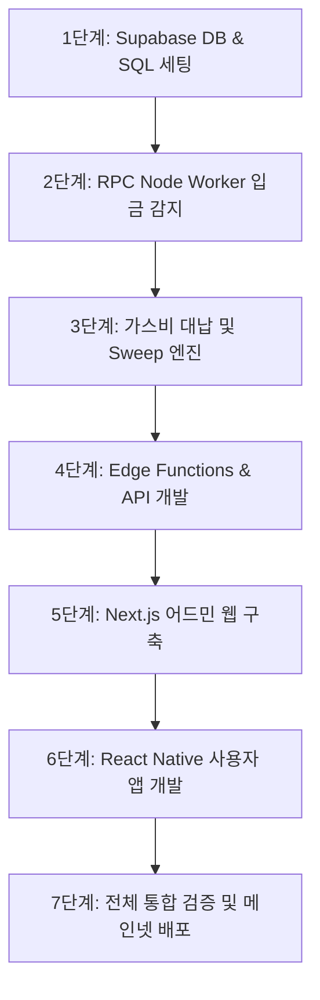

# 🗺️ 중앙화 지갑 및 관리자 시스템 개발 로드맵 (Development Roadmap)
> **중앙화 지갑 아키텍처의 유기적인 통합과 검증을 위한 단계별 개발 가이드라인**

본 로드맵은 Supabase 데이터베이스 세팅부터 블록체인 동기화 프로세스, 어드민 웹, 최종 React Native 모바일 앱에 이르기까지 무결한 구현을 위해 순차적으로 나열된 개발 단계입니다.

---

## 📌 전체 개발 아키텍처 요약 (흐름도)

모든 작업은 **데이터 정합성(DB & 원장)**을 가장 먼저 확보한 뒤, **백그라운드 통신(Worker & Functions)**, 그리고 **사용자 인터페이스(Web & App)** 순으로 개발을 진행하여 데이터 유실 리스크를 완벽하게 차단합니다.



---

## 🛠️ 단계별 세부 작업 정의 (Task Breakdown)

### 1단계: 개발 환경 구성 및 데이터베이스(Supabase) 초기화
데이터 무결성 조건(CHECK, UNIQUE, RLS)이 걸린 스키마를 Supabase에 적용하여 단단한 뼈대를 완성합니다.
- [ ] **Supabase 프로젝트 생성 및 로컬 CLI 세팅**
  - CLI 설치 및 `supabase init` 실행.
- [ ] **SQL 스키마 마이그레이션 파일 작성 (`supabase/migrations/`)**
  - `users`, `user_wallets`, `assets`, `user_balances`, `ledger_entries` 테이블 생성.
- [ ] **데이터베이스 제약 조건 및 인덱싱 적용**
  - `available_balance >= 0` 및 `locked_balance >= 0` CHECK 제약 조건 확인.
  - `ledger_entries.tx_hash` UNIQUE 제약 조건 확인.
- [ ] **RLS(Row Level Security) 정책 정의**
  - 일반 유저는 `auth.uid() = user_id` 조건으로 본인의 지갑, 잔고, 원장만 접근할 수 있도록 보안 잠금 처리.
- [ ] **기초 데이터(Seed) 삽입**
  - `assets` 테이블에 BNB, USDT, 자체 토큰(Contract Address 등록) 마스터 레코드 세팅.

---

### 2단계: 블록체인 동기화 데몬 (RPC Node Worker - 입금 감지)
네트워크 이벤트를 놓치지 않고 원장에 기록하는 독립 프로세스를 구현합니다.
- [ ] **Node.js RPC Worker 프로젝트 초기화 (`workers/rpc-watcher/`)**
  - TypeScript, ethers.js 또는 viem 라이브러리 설정.
- [ ] **BSC RPC 노드 연결 및 이벤트 리스너(Polling/WebSocket) 구현**
  - 지정된 블록체인 블록을 순회하며 토큰 컨트랙트의 `Transfer` 로그 필터링.
- [ ] **컨펌(Confirmation) 로직 설계**
  - 입금 트랜잭션 감지 시 즉시 반영하지 않고, 3~5 블록 컨펌을 대기하는 상태 추적 알고리즘 작성.
- [ ] **장부(Ledger) 기록 및 잔고 가산 로직 구현**
  - 입금 주소가 DB에 매핑된 주소인 경우, PostgreSQL 트랜잭션(`BEGIN; ... COMMIT;`)을 수행하여 `ledger_entries` 기록 및 `user_balances` 증가 처리.
  - `ON CONFLICT (tx_hash) DO NOTHING`을 적용하여 중복 반영 차단(멱등성 검증).

---

### 3단계: 지갑 모으기(Sweep) 엔진 개발
사용자 지갑에 쌓인 개별 자산을 마스터 볼트(Master Vault)로 취합하는 스케줄러를 개발합니다.
- [ ] **Master Vault 및 가스비 공급 주소 보안 설정**
  - 마스터 키/니모닉을 시스템 환경변수 및 암호화 볼트에 안전하게 탑재.
- [ ] **가스비 대납 스크립트 작성**
  - 유저 입금 주소의 BNB 잔고를 조회하여 가스비가 부족한 경우, 가스 공급 주소에서 해당 주소로 소량 BNB를 이송하는 로직 구현.
- [ ] **토큰 자동 Sweep 처리 구현**
  - BNB 입금이 컨펌되는 시점에 해당 유저 주소로부터 마스터 지갑 주소로 토큰 전액을 전송(Transfer)하는 트랜잭션 브로드캐스팅 및 영구 루프 예외 처리.

---

### 4단계: Supabase Edge Functions & 비즈니스 API 개발
출금 처리 및 스왑과 같은 핵심 트랜잭션 로직을 서버리스 환경에서 구동합니다.
- [ ] **출금 신청 API 구현 (`POST /api/v1/wallet/withdraw`)**
  - `user_balances` 테이블에서 신청 금액만큼 `available_balance`에서 마이너스하고 `locked_balance`로 플러스하는 DB 트랜잭션 처리.
- [ ] **USDT ↔ 자체 토큰 스왑 API 구현 (`POST /api/v1/wallet/swap`)**
  - 고정 혹은 오라클 가격 기반 스왑 비율 적용.
  - 수수료 차감 후 내부 원장 DB에 반영 (`SWAP_IN`, `SWAP_OUT`).
- [ ] **추천인 조직도 트리 API 구현 (`GET /api/v1/network/tree`)**
  - PostgreSQL의 CTE(Recursive Common Table Expression) 쿼리를 활용해 무제한 뎁스(Depth)의 계층형 추천인 데이터 구조화.

---

### 5단계: 관리자 백오피스 웹 (Next.js) 개발
운영진이 실시간으로 잔고 현황을 감시하고 출금을 통제할 수 있는 정교한 대시보드를 구축합니다.
- [ ] **Next.js 프로젝트 생성 및 TailwindCSS 테마 설정**
  - 프리미엄 다크 모드 인터페이스 및 최적화된 레이아웃 세팅.
- [ ] **통합 대시보드 통계 카드 개발**
  - 당일 누적 입금액, 누적 출금액, 가입 유저 수 등을 Supabase RPC(Stored Procedure)를 호출하여 실시간 데이터 렌더링.
- [ ] **유저 관리 및 대용량 트랜잭션 테이블 개발**
  - 가상 스크롤 및 필터링, 정렬이 지원되는 그리드 컴포넌트 탑재.
  - 특정 유저 자산 수동 보정 기능 구현.
- [ ] **출금 검토 및 최종 승인 모듈 개발**
  - `PENDING` 상태의 출금 건 확인 인터페이스 제공.
  - [승인] 클릭 시, 백엔드 보안 서명 모듈(Edge Function)을 호출하여 실제 온체인 트랜잭션 실행.

---

### 6단계: 사용자 모바일 앱 (React Native / Expo) 개발
일반 고객들이 지갑을 조회하고, 송금 및 스왑을 진행하며 조직도를 시각적으로 확인할 수 있는 환경을 빌드합니다.
- [ ] **Expo 기반 프로젝트 초기화 및 네비게이션 구조 설계**
  - Tab Navigation (Home, Swap, Network, Settings).
- [ ] **생체 인증(Bio-Auth) 모듈 탑재**
  - `expo-local-authentication` 등을 활용해 비밀번호 입력 외 TouchID/FaceID 대체 수단 도입.
- [ ] **입금 QR 스캔 및 내 주소 복사 기능**
  - 카메라 모듈 설정 및 주소 클립보드 복사 UX 제공.
- [ ] **트리 구조(조직도) 시각화 개발**
  - SVG나 계층 구조 전용 컴포넌트를 활용하여 추천 관계 차트 렌더링.
- [ ] **스왑 & 송금 인터페이스 구현**
  - 슬리피지 설정 및 실시간 예상 수령량 계산기 제공.

---

### 7단계: 전체 통합 검증 및 메인넷 배포
구축된 솔루션을 안전하게 릴리즈하기 위한 모의 시나리오 검토와 네트워크 마이그레이션을 실행합니다.
- [ ] **BSC 테스트넷(Testnet) 환경에서 엔드투엔드 테스트**
  - 테스트넷 수도꼭지(Faucet)로 BNB, tUSDT 획득 후 입금 -> Sweep -> 출금 신청 -> 어드민 승인 -> 온체인 전송 전 과정 반복 검증.
- [ ] **재진입 공격 및 잔고 오차 시뮬레이션**
  - 동시에 다발적으로 출금을 신청하거나 스왑을 수행해 내부 락(Lock) 및 복식부기 원장 정합성 깨짐 여부 확인.
- [ ] **메인넷(Mainnet) 마이그레이션**
  - 실제 컨트랙트 배포 주소를 `assets`에 매핑하고 핫월렛에 실제 자산을 로드해 최종 시스템 가동.
- [ ] **상시 모니터링 시스템 구축**
  - RPC Worker 다운 감지(Uptime Kuma, PM2 Alert) 및 대량 자산 유출 경보(Discord Webhook 연동) 구성.

---

## 📈 프로젝트 폴더 구조 제안 및 작업 템플릿

```text
wallet/
├── ROADMAP.md              # [현재 파일] 개발 마일스톤 가이드
├── README.md               # 기술 사양 표준 정의서
├── apps/
│   ├── mobile/             # React Native (Expo)
│   └── admin/              # Next.js
├── supabase/               # Backend DB & Migration
└── workers/
    └── rpc-watcher/        # Blockchain Sync Daemon
```
