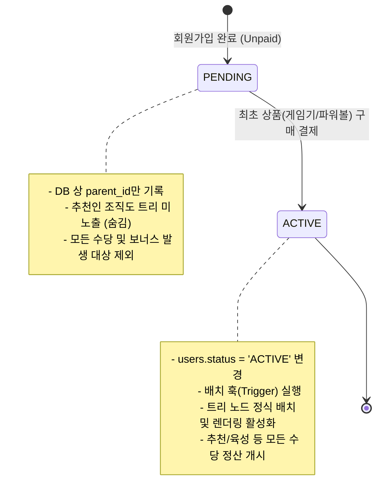

# 📄 [기획 사양서 v1.1] 369 게임보상플랜 및 정산 시스템 분석 명세
> **v1.1 업데이트에 따른 데이터베이스 모델링 및 정산 시스템 설계 변경점**

본 문서는 기획 사양 v1.1의 변경 사항을 완벽히 분석하고, 이를 데이터베이스(Supabase/PostgreSQL) 수준과 스케줄러(Cron Job) 비즈니스 로직에 반영하기 위한 핵심 개발 지침을 상세화합니다.

---

## 1. 화폐 및 자산 기본 정의 (USDT & URC)

플랫폼 내부에서 관리되는 자산은 다음 두 가지 토큰으로 제한되며, 소수점 자릿수는 BEP-20 표준에 맞추어 관리합니다.

| 자산 기호 | 토큰 명칭 | 성격 | 가치 기준 |
| :--- | :--- | :--- | :--- |
| **USDT** | Tether (BEP-20) | 메인넷 결제 및 출금 화폐 | $1.00 USD 고정 |
| **URC** | Universal Real Currency | 플랫폼 내부 게임 보상 토큰 | $1.00 USD (약 1,500 KRW 고정 가치) |

### 🔄 스왑 및 출금 수수료 정책
*   **USDT ↔ URC 1:1 즉시 스왑**: 내부 잔고 변경으로 실시간 처리되며, **0.1% 스왑 수수료**가 차감되어 회사 수익 지갑(Master Fee Address)으로 적재됩니다.
*   **출금 수수료 및 금액 조건**: 
    *   최소 출금 가능 금액은 **$50**입니다.
    *   $50 이상인 경우 고정 단위 제한 없이 자유롭게 출금 신청이 가능합니다.
    *   출금 시 **5% 출금 수수료**가 원천 징수된 후 외부 지갑으로 전송됩니다.

---

## 2. 게임 참여 및 게임기(Game Machine) 모델링

### 🎰 게임기 구매 및 입장 횟수 누적 (v1.1 수정)
사용자는 여러 대의 게임기를 중복 구매할 수 있으며, 입장 가능 횟수는 고정 100회 제한이 아닌 **구매한 모든 게임기의 잔여 입장 횟수 총합**으로 실시간 누적 관리됩니다.

```text
유저 최대 입장 가능 횟수 = SUM(구매한 각 게임기별 제공 횟수) - SUM(사용 완료된 입장 횟수)
```

| 구분 | 구매 금액 | 기본 제공 입장 횟수 | 순환 지급율 (보너스 한도) | 추가 보너스 |
| :--- | :--- | :--- | :--- | :--- |
| **1단계** | $100 | 10회 | 200% ($200 한도) | - |
| **2단계** | $500 | 50회 | 250% ($1,250 한도) | 홍바오 1개 |
| **3단계** | $1,000 | 100회 | 300% ($3,000 한도) | 홍바오 3개 |

*   **환불 및 매출 개시 원칙**: 게임기 구매 금액은 취소가 절대 불가하며, 구매 행위 자체로는 마케팅 수당이 지급되지 않고 **실제 경기 입장(Ticket Consume)이 이루어져야 정산이 시작**됩니다.

### 🎯 경기 입장(Ticket) 및 게임 추첨 규칙
*   **입장 비용**: 경기 1회 입장 당 **$100 소모** (보보유한 게임기 잔여 횟수 내에서 멀티 입장 가능).
*   **재화 소모**: 입장 시 **파워볼 3개**가 추가로 즉시 차감됩니다.
*   **경기 스케줄 (북경 시간 기준 / AI 추첨 발표는 30분 뒤)**:
    *   **1회차**: 11:00 ~ 12:00 (발표 12:30)
    *   **2회차**: 14:00 ~ 15:00 (발표 15:30)
    *   **3회차**: 17:00 ~ 18:00 (발표 18:30)
*   **당첨/미당첨 정산 메커니즘**:
    *   **당첨 시 (USDT 90% + URC 10% 정산)**: 
        *   USDT 정산: 원금($100) + 2%($2) = **$102 USDT** 지급.
        *   URC 정산: `[15% x 6회] + [0.5% x 40회] = 110%` ➔ **$110 URC** 지급.
        *   *주의: 당첨 시 구매한 게임기 지급율 총량에서 당첨 금액만큼 누적 차감되며, 원금을 모두 찾은(지급율 초과) 유저는 추가 게임 참여가 제한됩니다.*
    *   **미당첨 시**: 10회 중 1회는 무조건 당첨되는 10-1 구성을 지원하며, 미당첨 시 사용된 입장권 환불은 발생하지 않습니다.

---

## 3. 회원 등급 및 추천 조직도(Tree) 배치 라이프사이클

가장 중요한 보안 및 마케팅 수당 왜곡을 차단하기 위해, 비활성화 회원은 트리상에 존재하지 않도록 논리적으로 완전히 격리합니다.



### ⚙️ 데이터베이스 트리거 (Trigger) 설계 방향
`users` 테이블에 `status` 컬럼(`PENDING`, `ACTIVE`)을 추가하고, 결제가 성공하여 status가 `ACTIVE`로 변경되는 시점에만 트리 인덱스 테이블 및 어드민/앱 조직도 뷰에서 이를 렌더링할 수 있도록 쿼리를 필터링합니다.

---

## 4. 보너스 정산 체계 및 마감 스케줄러

수당 정산은 과부하 방지를 위해 **실시간 정산**과 **일마감 배치 정산**으로 명확히 구분하여 처리합니다.

### 4.1 실시간 정산 보너스 (Real-time Payout)
*   **추천 보너스 (1차)**: 내 직속 추천인(1대)의 경기 입장 매출의 **20%** 실시간 지급.
*   **육성 보너스 (2차)**: 내 2대 하위 회원의 경기 입장 매출의 **10%** 실시간 지급.
*   **임마 보너스**: 추천인 3명 조건을 충족한 회원에 한해, 하위 육성 보너스 발생 금액의 **10%**를 실시간 추가 지급.

### 4.2 일마감 정산 보너스 (Daily Close at 00:00 KST / 23:00 Beijing)
*   **최탄 보너스**: 하위 전체 매출의 **10%** 재원을 적립하여 조건 충족자 대상 **1/N** 일괄 공유 정산.
*   **직급 보너스 (Rank Bonus)**: 1대 추천인의 누적 게임기 매출 조건에 따라 직급이 결정되며, **1/N 중복공유** 방식으로 매일 밤 일괄 계산하여 정산합니다. (수당 수수료 0.1% 원천징수 적용)

| 직급 | 1대 추천인 게임기 누적 조건 | 지급율 (1/N 풀 공유) |
| :--- | :--- | :--- |
| **1스타** | $1,000 | 5% |
| **2스타** | $3,000 | 4% |
| **3스타** | $10,000 | 2% |
| **4스타** | $30,000 | 1% |
| **5스타** | $100,000 | 1% |
| **6스타** | $300,000 | 1% |
| **7스타** | $1,000,000 | 1% |

---

## 5. 백엔드 데이터베이스 구현 세부 아웃라인

### 5.1 `users` 테이블 추가 변경안
```sql
ALTER TABLE public.users ADD COLUMN status TEXT DEFAULT 'PENDING' NOT NULL;
ALTER TABLE public.users ADD CONSTRAINT check_user_status CHECK (status IN ('PENDING', 'ACTIVE'));
```

### 5.2 게임기 구매 내역 및 잔여 횟수 뷰(View)
유저의 실시간 남은 입장 횟수를 효율적으로 조회하기 위한 DB View를 생성합니다.
```sql
CREATE OR REPLACE VIEW public.v_user_game_allowance AS
SELECT 
    u.id AS user_id,
    COALESCE(SUM(gm.total_entry_limit), 0) AS total_purchased_entries,
    COALESCE(SUM(gm.used_entries), 0) AS total_used_entries,
    (COALESCE(SUM(gm.total_entry_limit), 0) - COALESCE(SUM(gm.used_entries), 0)) AS remaining_entries
FROM public.users u
LEFT JOIN public.user_game_machines gm ON u.id = gm.user_id
GROUP BY u.id;
```

### 5.3 일마감 스케줄러 스크립트 (Node.js/Supabase Edge function - cron)
매일 밤 00:00 KST에 수행되는 정산 스케줄러 의사코드(Pseudocode)입니다.
```typescript
import { createClient } from '@supabase/supabase-js';

const supabase = createClient(process.env.SUPABASE_URL!, process.env.SUPABASE_SERVICE_ROLE_KEY!);

export async function handleDailySettlement() {
  // 1. 당일 총 경기 입장 매출(USDT) 집계
  const { data: dailySales } = await supabase.rpc('get_daily_game_sales');
  
  // 2. 직급 조건 재평가 및 직급별 1/N 대상자 리스트업
  await supabase.rpc('evaluate_user_ranks');
  
  // 3. 최탄 보너스 재원(10%) 계산 및 분배 대상자 1/N 정산
  const choitanPool = dailySales * 0.1;
  await supabase.rpc('distribute_choitan_bonus', { pool_amount: choitanPool });
  
  // 4. 직급 보너스(1스타 ~ 7스타) 단계별 1/N 정산 처리
  // 각 스타 단계별 총액 = daily_sales * 지급율
  // 수당 수수료 0.1% 차감 정책 적용하여 최종 ledger_entries와 user_balances에 반영
  await supabase.rpc('distribute_rank_bonuses', { daily_sales: dailySales });
  
  console.log("Daily settlement completed successfully.");
}
```
